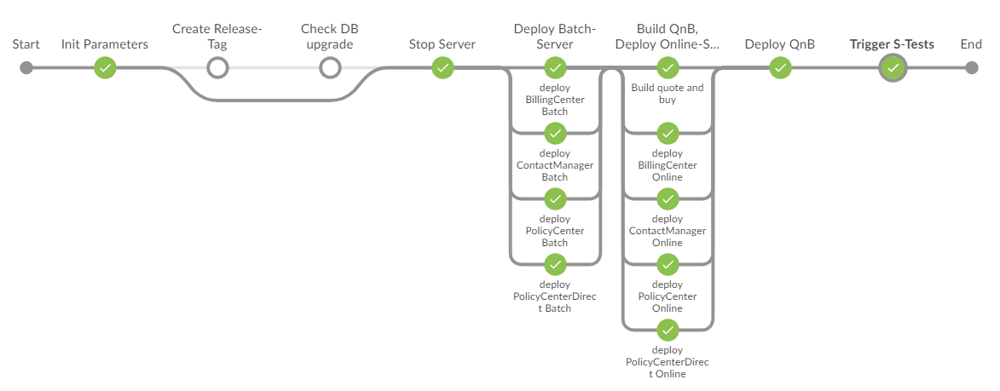
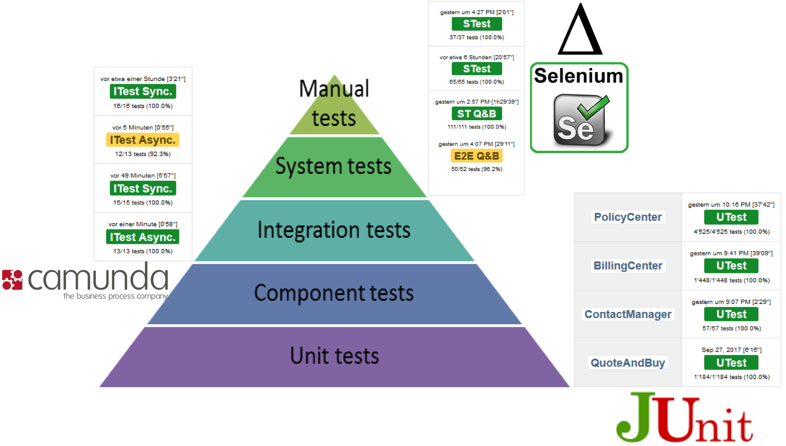
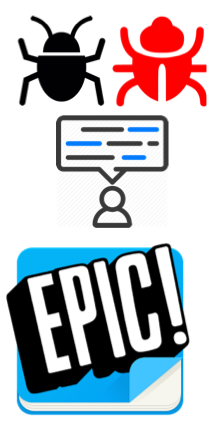
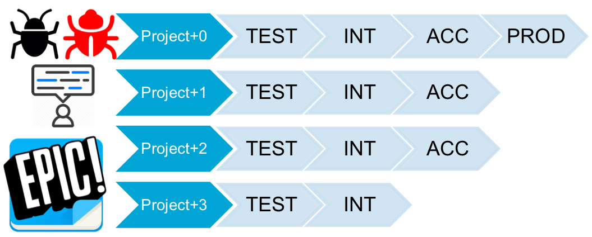
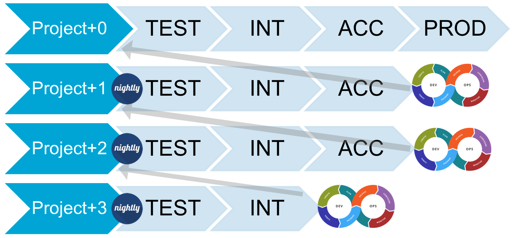
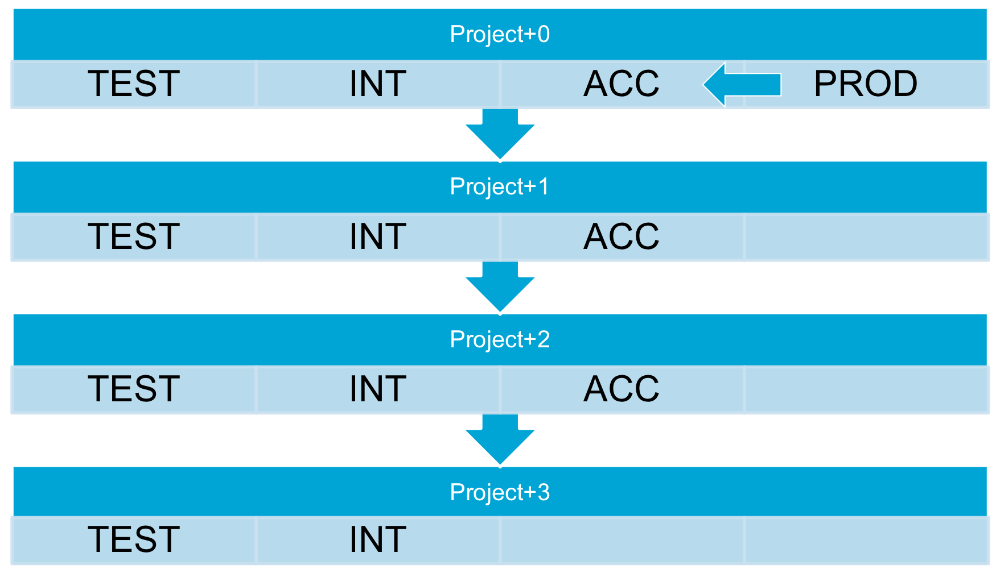
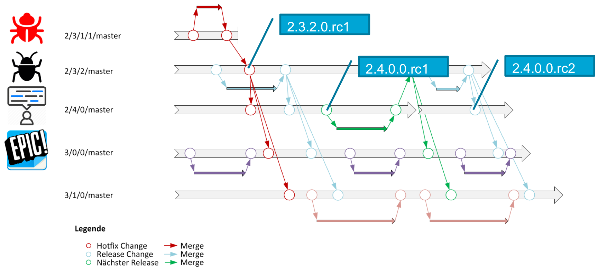

---

# Pipelining Quality

[BaselOne](https://baselone.ch) - 16.10.2018

---
@title[about]
 

[@MarkusTiede](https://twitter.com/markustiede)

Software, Security & **Release Engineer** @ [Baloise](https://www.baloise.com)

+++

## @color[goldenrod](2 lessons learned)

@color[darkgreen](~10 best practices) & all (mostly OSS) [tools](https://en.wikipedia.org/wiki/Tool) we use

+++?image=https://github.com/baloise/talk-cicd-javascript/raw/master/img/baloise-park.jpg&size=contain

## @color[white](about/[baloise](https://www.baloise.com))

+++?image=http://amazingspace.org/resources/explorations/groundup/lesson/scopes/galileo/graphics/tele_galileo_big.jpg&size=contain

## about/[galileo](https://www.guidewire.com/about-us/news-and-events/press-releases/20160912/basler-versicherung-extends-guidewire-products)

+++?image=https://ak8.picdn.net/shutterstock/videos/15411808/thumb/2.jpg&size=contain
@title[insights]

large-scale enterprise project

1.3k parallel sessions / day

4+ products

in- and outbound services

8 Scrum teams work in parallel

+++?image=https://upload.wikimedia.org/wikipedia/commons/4/43/Angry_elephant_ears.jpg&size=contain

## @color[white](some #numbers)
@color[white](Cluster of 4 * [2 + 1] nodes)

@color[white](~150 GB RAM / cluster)

@color[white](24/7 up-time)

@color[white](~30 min / rollout)

@color[white](30+ production releases per year)

---

## release management 

high-level goal: __knowledge__

1. dates: code-freeze, going-live
2. content: fixes, features, epics
3. quality: results, coverages

+++?color=lightgreen

## (un)known knowns: @color[goldenrod](predictability)

**fix** forecast of goals: dates / content / quality

+++?color=darkred

## (un)known unknowns: @color[goldenrod](flexibility)

on knowledge gain: **variable** re-definition of goals

e.g. other dates / other content / quality++

unknown → known

---

## @color[goldenrod](predictability)

- knowledge (tracking): digital dashboard
- automate everything
- constant knowledge gain: fail fast & early
- freeze / reproduce states: snapshots, versioning
- dedicated releng
- deceleration: T → I → A → P
- data: only PROD is PROD
- batching

+++

## @color[goldenrod](flexibility)
- embrace alternatives: parallelization
- be prepared: fastlane
- be observant: monitoring

---

## knowledge dashboard

everything @color[darkgreen](digital and connected)

[Confluence ↔ JIRA](https://de.atlassian.com)↔ [git](https://git-scm.com) ↔ environments ↔ deployments ↔ tests
 
under @color[darkgreen](version control)

[github.com/dashboard-plus](https://github.com/baloise/dashboard-plus)

+++?image=img/dashboard.png&size=contain
@title[knowledge dashboard]

---?image=https://upload.wikimedia.org/wikipedia/commons/0/05/Devops-toolchain.svg&size=contain

## automate everything

@color[darkgreen](**everything** as code)

application(s), build(s), deploy(s), rollout(s), test(s), environment(s), runtime(s)

+++

## application(s) & build(s)

[Java 8](https://www.java.com/de/download/) and [Jakarta EE](https://jakarta.ee)

[gradle](https://gradle.org) and [maven](https://maven.apache.org)

running independently in [Jenkins OSS](https://jenkins.io) pipelines

publish artifacts 

+++

## deploy(s) & rollout(s)

+++
@title[test(s)]

[JUnit](https://junit.org), [Camunda BPMN Workflow Engine](https://camunda.com) and [Selenium](https://www.seleniumhq.org)

+++

## environment(s), runtime(s)

[VM](https://en.wikipedia.org/wiki/Virtual_machine)s with [RHEL](https://en.wikipedia.org/wiki/Red_Hat_Enterprise_Linux) and [Liima](http://www.liima.org)

using [Ansible](https://www.ansible.com)

future: [OpenShift](https://en.wikipedia.org/wiki/OpenShift)

---?image=https://i.imgur.com/RVvnuO5.jpg&size=contain

## @color[white](freeze states)

+++

### sprint theory

<canvas data-chart="line">
<!-- 
{
 "data": {
  "labels": ["We","Th","Fr","Mo","Tu","We","Th","Fr","Mo","Tu"],
  "datasets": [
   {
    "data":[0,15,25,35,45,55,65,75,85,100],
    "label":"Team 1","borderColor":"rgba(20,220,220,1)"
   },
   {
    "data":[0,10,20,30,40,50,60,70,80,100],
    "label":"Team 2","borderColor":"rgba(220,120,120,1)"
   },
   {
    "data":[0,5,15,25,35,45,55,65,75,100],
    "label":"Team 3","borderColor":"rgba(135,206,250,1)"
   }
  ]
 }, 
 "options": { "responsive": "true" }
}
-->
</canvas>

+++

### real world

<canvas data-chart="line">
<!-- 
{
 "data": {
  "labels": ["We","Th","Fr","Mo","Tu","We","Th","Fr","Mo","Tu"],
  "datasets": [
   {
    "data":[0,15,25,25,20,40,55,50,65,60],
    "label":"Team 1","borderColor":"rgba(20,220,220,1)"
   },
   {
    "data":[0,35,20,30,45,55,60,75,70,75],
    "label":"Team 2","borderColor":"rgba(220,120,120,1)"
   },
   {
    "data":[0,5,15,20,30,35,45,55,60,70],
    "label":"Team 3","borderColor":"rgba(135,206,250,1)"
   },
   {
    "data":[0,25,10,35,20,45,30,55,40,65],
    "label":"3rd party dependencies","borderColor":"rgba(144,238,144,1)"
   }
  ]
 }, 
 "options": { "responsive": "true" }
}
-->
</canvas>

+++

### @color[darkgreen](artifact repositories)

@color[darkgreen](continuous SNAPSHOTs) on green (JUnit) build(s)

1 x nightly @color[darkgreen](semi-permanent SNAPSHOTs) / application

time frame: max. 8 weeks

all @color[darkgreen](release candidates == **RELEASE**)

[Nexus Repository OSS](https://www.sonatype.com/nexus-repository-oss)

---?image=https://www.uschamber.com/sites/default/files/styles/article_gallery/public/articles/images/bloomberg_pipelines_cushing_1600px.jpg&size=contain

## @color[white](dedicated releng)

+++

dedicated people / teams for releng

releng-repo for cross-app scripted pipelines used in CI/CD

Jenkins: Shared Libraries

[jenkinsci/JenkinsPipelineUnit](https://github.com/jenkinsci/JenkinsPipelineUnit)

+++

## @color[darkgreen](deceleration: T → I → A → P)

RCs: **r**elease **c**andidate(s) - dedicated code freeze dates

nightly: T → **+1d** → I → **+2d** → A → **+3d** → P

+++

## release classes

epics, user stories and (blocking) bugs

identical treatment

MAJOR (+123d) == MINOR (+123d) == MICRO (+1d) == HOTFIX (+4h)

+++

## @color[darkgreen](data: only PROD is PROD)

3 times a year ACC becomes PROD

ACC is treated as PROD

---?image=https://www.grund-wissen.de/mathematik/_images/abstand-parallele-geraden.png&size=contain

+++?image=https://blog.seibert-media.net/wp-content/uploads/2015/07/Git-Merging.png&size=contain

[Jenkinsfile](https://jenkins.io/doc/book/pipeline/jenkinsfile/) and [Pipeline Multibranch Plugin](https://wiki.jenkins.io/display/JENKINS/Pipeline+Multibranch+Plugin)

+++

## @color[darkgreen](fast lane)s

+++

## @color[darkgreen](artifacts / stacks)

+++

## @color[darkgreen](data)

+++

## @color[darkgreen](in- / dependent branching / merging)

---?image=https://res.cloudinary.com/teepublic/image/private/s--K35E_lTm--/t_Preview/b_rgb:c8e0ec,c_limit,f_jpg,h_630,q_90,w_630/v1478503582/production/designs/790282_1.jpg&size=contain

## @color[darkgreen](batch)@color[white](ing)

---

## monitoring

+++

## knowledge (graphs)

---?image=http://ludwinedekker.com/wp-content/uploads/2017/08/brain-2029391_1280-1200x1076.png&size=contain

## automation is key

[github.com/baloise/talk-cicd_pipelining_quality](https://github.com/baloise/talk-cicd_pipelining_quality)

+++

# Thanks! 
## Q&A?
